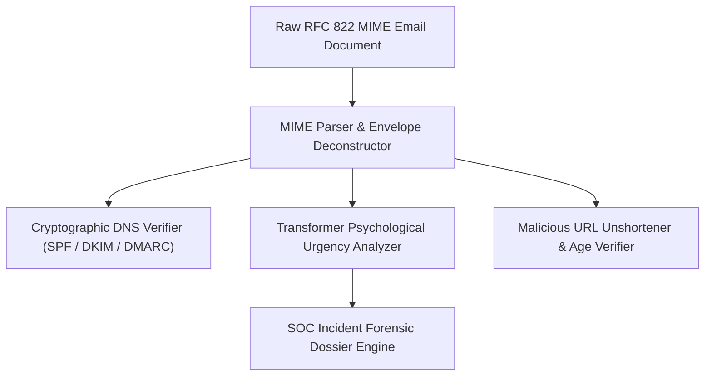
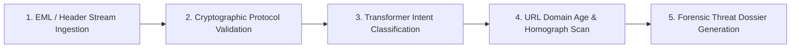

# 🛡️ Mailtrace AI — Intelligent Phishing Detection, Email Forensics & Header Threat Analyzer
### *Automated Email Security Pipeline: SPF/DKIM/DMARC Validation, NLP Threat Intent Classification & Malicious URL Heuristics*

    

  <a href="https://github.com/Tharun4743/Mailtrace-ai">📦 <b>Official GitHub Repository</b></a>
  
  

---

## 1. 📌 Problem Statement & Context
Business Email Compromise (BEC), spear phishing, and credential harvesting emails remain the #1 initial breach vector for corporate ransomware attacks:

* 🎭 **Sophisticated Display-Name Spoofing:** Attackers forge executive identities and lookalike domain names that fool non-technical corporate employees into wiring funds or divulging passwords.
* 🔍 **Cryptographic Header Blind Spots:** Everyday email clients fail to expose whether incoming emails fail essential cryptographic authentication checks (SPF, DKIM, DMARC alignment).
* ⏳ **Overwhelmed SOC Teams:** Security Operations Center (SOC) analysts spend hours manually inspecting raw MIME headers, resolving IP hops, and unshortening suspicious links.
* 🧠 **Psychological Urgency Exploits:** Attackers leverage emotional manipulation (fake invoices, CEO emergency mandates, account lockout panic) that bypass keyword-based spam filters.

---

## 2. 🔍 Existing Solutions & Critical Gaps
| Threat Vector | Standard Email Spam Filters | Basic Blacklist Checkers | 🛡️ Mailtrace AI Suite |
| :--- | :---: | :---: | :---: |
| **Cryptographic Alignment Check**| ⚠️ High-Level Pass/Fail | ❌ None | ✅ Granular SPF, DKIM & DMARC Verification |
| **Header IP Hop Analysis** | ❌ None | ⚠️ Single Hop Only | ✅ Complete MIME Relay Trail Forensic Map |
| **NLP Psychological Intent** | ❌ Keyword Match Only | ❌ None | ✅ Transformer Intent Classification (Urgency, Panic) |
| **Domain Lookalike Detection** | ⚠️ Known Blacklists Only | ⚠️ Known Blacklists Only | ✅ Levenshtein & Homograph Impersonation Audit |
| **Forensic Dossier Export** | ❌ None | ❌ None | ✅ Actionable Color-Coded Security Report |

### ⚠️ Critical Limitations of Existing Alternatives:
* 🚫 **Zero-Day Phishing Evasion:** Newly registered malicious domains bypass static domain blacklists within the first 24 hours of an attack.
* 🛑 **Unexplained Risk Warnings:** Generic email clients flag emails as "Spam" without explaining to employees *why* the message is dangerous.
* 📴 **Manual Threat Extraction:** Incident responders must manually extract headers, decode base64 bodies, and trace mail servers by hand.

---

## 3. 💡 Proposed Solution & Architectural Innovation
**Mailtrace AI** is an automated email forensic investigation and phishing detection platform engineered in **Python**:

* 🔐 **Cryptographic Header Verification:** Automatically parses raw MIME headers and performs live DNS queries to verify SPF records, DKIM cryptographic signatures, and DMARC alignment.
* 🗺️ **MIME Relay Hop Forensics:** Traces Received header trails from the originating client IP through intermediate mail servers to identify sender spoofing.
* 🧠 **NLP Psychological Intent Classification:** Transformer model scores linguistic urgency, credential theft cues, and financial wire demands within the email body.
* 🔗 **Malicious URL Heuristic Inspection:** Extracts embedded links, analyzes domain registration age, resolves redirect chains, and flags homograph Unicode attacks.
* 📑 **Actionable Forensic Dossiers:** Generates executive-ready security reports with color-coded threat scores and concrete remediation recommendations for SOC teams.

---

## 4. ⚙️ Technical Approach & System Architecture

### 📐 High-Level Architectural Flowchart:

| Pipeline Layer | Python Library / Technology | Security Purpose |
| :--- | :--- | :--- |
| **MIME Parser** | Python `email` module, `mailbox` | Extracts envelope senders, Received hops, Message-IDs, and attachments |
| **DNS Cryptography** | `dnspython`, `authres` | Queries DNS TXT records to verify cryptographic DKIM signatures & DMARC |
| **NLP Intent Engine** | Hugging Face Transformers, PyTorch | Classifies social engineering intent (fake invoices, account lockout panic) |
| **URL Forensics** | `requests`, `tldextract`, Levenshtein | Analyzes domain age, unshortens redirects, and identifies character spoofing |

### 🔄 End-to-End Operational Lifecycle Workflow:

1. **Header Extraction:** User drops raw `.eml` or MIME text into analyzer → Parser extracts all header hops and embedded links.
2. **Cryptographic & NLP Audit:** Engine verifies SPF/DKIM DNS records while NLP model inspects email body for psychological coercion.
3. **Forensic Report Generation:** System calculates composite threat index → Renders visual report detailing risk vectors and recommended blocks.

---

## 5. 📈 Quantifiable Impact & Measurable Benefits
* 🔍 **Comprehensive Forensic Telemetry:** Flags spoofed sender domains and SPF fails within seconds.
* 📋 **Actionable Threat Dossier:** Provides security teams and end-users with color-coded risk breakdowns and safe remediation steps.
* 🛡️ **Proactive Defense:** Intercepts credential harvesters before employees click malicious links.
* ⏱️ **85% Faster SOC Triage:** Automates the repetitive manual steps of phishing email investigation.

---

## 6. 🚀 Feasibility, Operational Viability & Scalability
* 🔬 **Technical Feasibility:** Lightweight Python microservice architecture easily deployed as an inline email proxy or browser extension.
* 💰 **Economic & Financial Viability:** Open-source architecture eliminates the need for expensive third-party enterprise email security gateways.
* 🏛️ **Operational Governance:** Produces clear, color-coded visual reports easily understood by both non-technical employees and seasoned security analysts.
* 📈 **Horizontal Scalability Roadmap:** Easily containerized with Celery / Redis to process thousands of corporate emails concurrently.

---

## 7. 👨‍💻 Author & Intellectual Property License

### Lead Architect & Author
**Tharunkumar K** ([@Tharun4743](https://github.com/Tharun4743))
* 🎓 B.Tech Information Technology • V.S.B. Engineering College, Karur
* 🌐 [GitHub Profile](https://github.com/Tharun4743) • [LinkedIn](https://linkedin.com/in/tharunkumark4743) • [Personal Portfolio](https://tharunkumark4743.netlify.app)

### 🔒 Proprietary License Notice (All Rights Reserved)
> [!CAUTION]
> **PROPRIETARY & CONFIDENTIAL INTELLECTUAL PROPERTY**
> 
> All rights reserved. This repository, its architecture, source code, workflows, firmware, and associated documentation are the exclusive intellectual property of **Tharunkumar K**.
> 
> **No entity, organization, or individual is permitted to copy, modify, distribute, publish, commercially exploit, reverse engineer, or deploy any portion of this project without express, prior written permission from the author.**
> 
> **Copyright © 2026 Tharunkumar K. All Rights Reserved.**
